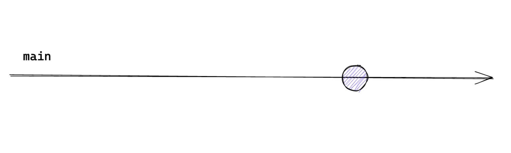
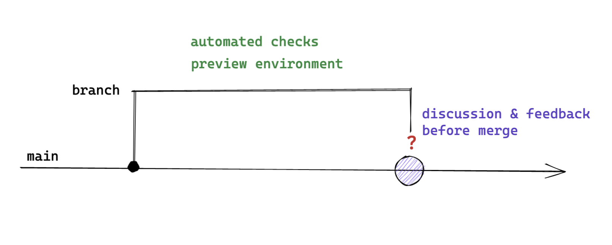

## We work collaboratively

Writing code should be a collaborative process by default, otherwise we would not need teams. Pair programming and mob programming are not only encouraged but expected to be practiced. There can be good (also personal) reasons to work on a task alone, but it should not be the default.  

Solving problems and writing code in groups not only increases confidence in the solutions created but also lead to overall better performance and enjoyment[^1]. 

We reduce the need for asynchronous Pull Requests and instead have the quickest possible feedback loop through writing code together. We apply Ship/Show/Ask[^2] in order to only use Pull Requests as a blocking gate for shipping something when necessary while still keeping code reviews as an integral part of sharing knowledge and receiving feedback.  

### Ship / Show / Ask

Visualisations taken from Martin Fowler's blog post.[^2]

#### Ship
No Pull Request, simply push to the main branch. 

#### Show
Open a Pull Request, but merge already after the build passes. Others can still review your changes and give feedback, but you are not blocked. 

#### Ask
Open a Pull Request and wait for feedback and approval before merging. 

Working together on a task should be the default.

[^1]: John T. Nosek, [_The Case for Collaborative Programming_](https://www.researchgate.net/publication/27295641_The_Case_for_Collaborative_Programming), Communications of the ACM, March 1998
[^2]: https://martinfowler.com/articles/ship-show-ask.html
