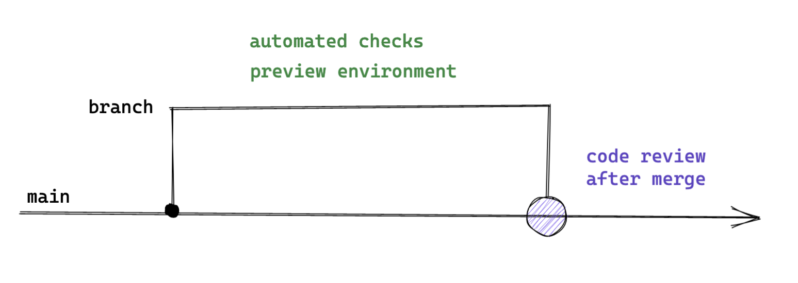

## We work collaboratively

Writing code should be a collaborative process by default, otherwise we would not need teams. Pair programming and mob programming are not only encouraged but expected to be practiced. Not every task might be fit for collaborative work, but a lot more than we might assume actually are.

Solving problems and writing code in groups not only increases confidence in the solutions created but also leads to overall better performance and enjoyment[^1]. 

We reduce the need for asynchronous Pull Requests and instead have the quickest possible feedback loop through writing code together. We apply Ship/Show/Ask[^2] in order to only use Pull Requests as a blocking gate for shipping something when necessary while still keeping code reviews as an integral part of sharing knowledge and receiving feedback.  

Working together on a task should be the default.

### Ship / Show / Ask

Ship / Shop / Ask provides some guidelines to decide when it is actually necessary to wait for approvals on a Pull Request, when it is sufficient to open a Pull Request purely for informational purposes and when we can directly push changes into the main branch. 

Visualisations taken from Martin Fowler's blog post.[^2]

#### Ship

Do not open a Pull Request, push directly to the main branch instead. 

For trivial changes that do not involve any kind of technical or architectural decision, there would be not a lot of value in showing it to others and even less in waiting for approvals before processing. This works best for codebases with high quality standards, as a high test coverage and tools like static code analysers can greatly reduce the risk of unintended side effects and slip ups.

#### Show

Open a Pull Request, but merge directly after the build passes. Others can still review your changes and give feedback, but you are not blocked. 

This is great for a small(-ish) change that does not make fundamental changes to how the application is designed and how it works. It is valuable to share the change so others have a chance to see what you did and also how you did it.

#### Ask

Open a Pull Request and wait for approvals before merging.

Changes that involve non-trivial technical decisions, architectural changes or that you are just not very confident about should lead to a blocking Pull Request. 

[^1]:  Alistair Cockburn and Laurie Williams, [_The Costs and Benefits of Pair Programming_](https://collaboration.csc.ncsu.edu/laurie/Papers/XPSardinia.PDF), 2000
[^2]: https://martinfowler.com/articles/ship-show-ask.html
