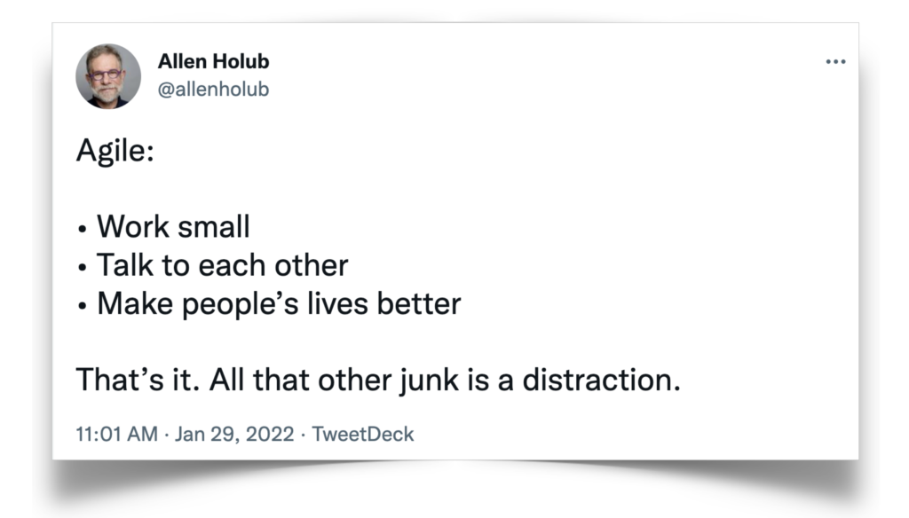

## We are truly agile

Despite its age, the Agile Manifesto still holds valuable principles[^1] that are too often being ignored when companies talk about "being agile". Applying Scrum or similar frameworks will not make us agile if we do not understand the key concepts[^2].

Many of the following principles try to account for that, such as working in small steps and collaborating closely.  

[^1]: https://agilemanifesto.org/principles.html
[^2]: https://holub.com/heuristics/

