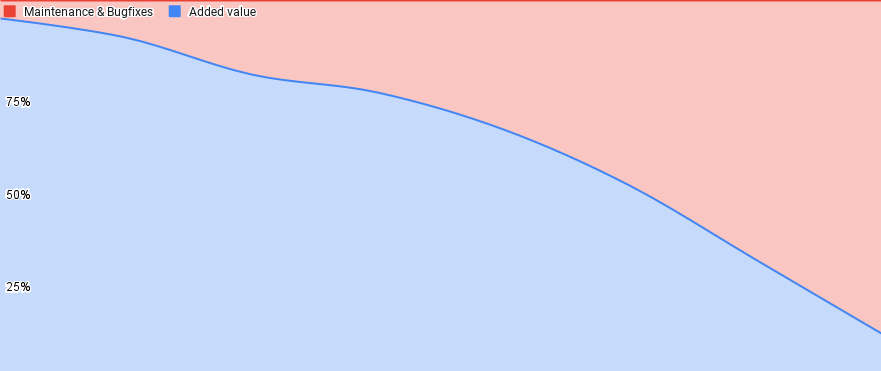

## We cut scope, not quality

Our work happens in a triangle of quality, time and scope. We deliberately limit time and any cutback on quality will make our lives harder in the future. This leaves us with one variable: scope. We should always strive to find the smallest possible scope to meet the needs of our customers and ourselves. We do this constantly before and also while we work on something [^1].

### Quality is not optional

Making sacrifices on the quality of the solutions will build comes always comes at a price. "Technical debt" is a common term in software development, and using it bears the risk of normalizing the violation of the rules we established for good reasons. "Debt" implies that we have taken a loan that we need to pay back some time in the future, but everyone working in this field has experienced that happens very rarely. Ultimately that means the negative effects of those quality cuts (e.g. missing tests or incomplete automation) will accumulate to an extent that will almost completely keep us busy with maintenance and a never-ending input stream of bugs. 

(Placeholder chart with made-up numbers). Low quality releases will gradually lead to a high share of maintenance and bug-fixing, eventually blocking us from creating new value for our customers. Adding value can then only be accomplished by adding more Software Engineers to the teams. Our goal must be to keep maintenance load on a reasonable level instead. 

Not only will bugfixes become incredible expensive in terms of effort and customer impact when they are discovered after release[^2], but they destroy our focus. Some bugs can seemingly wait, so we dump them into backlogs, hoping to get to them at some point, but in the end that is a fight we can only lose. The better we shape our solutions and the closer we work together on them from the very beginning (read: before writing any code), the better the outcome will be. 

[^1]: https://basecamp.com/shapeup/1.2-chapter-03#fixed-time-variable-scope
[^2]: https://deepsource.io/blog/exponential-cost-of-fixing-bugs/